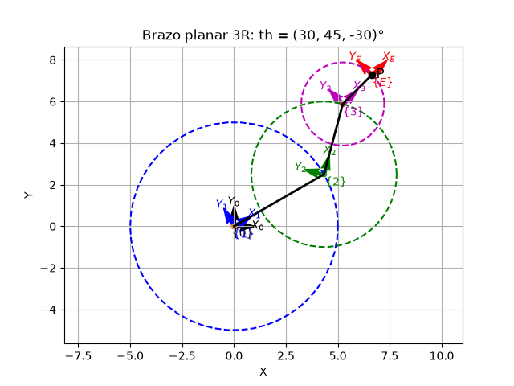
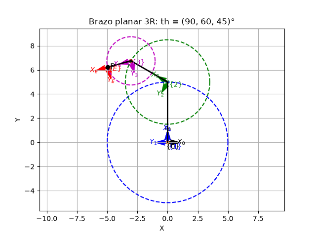

# Reporte 1: Brazo planar de 3 eslabones

**Nombre:** Diego Crespo Padilla
**Fecha:** 6 de octubre de 2026

## Description

El script `arm3planar.py` dibuja un brazo planar de tres eslabones usando transformaciones homogéneas 2D. Cada eslabón tiene su propio marco de referencia, encadenado al anterior, además de un marco en el efector final. También dibuja un círculo punteado por eslabón, centrado en su articulación y con radio igual a la longitud del eslabón.

## Parameters

| Parameter | Value |
|---|---|
| L1 | 5 |
| L2 | 3.5 |
| L3 | 2 |

## Results

### Angles set 1

th1 = 30°, th2 = 45°, th3 = -30°

### Angles set 2

th1 = 90°, th2 = 60°, th3 = 45°

## Code

[arm3planar.py](arm3planar.py)